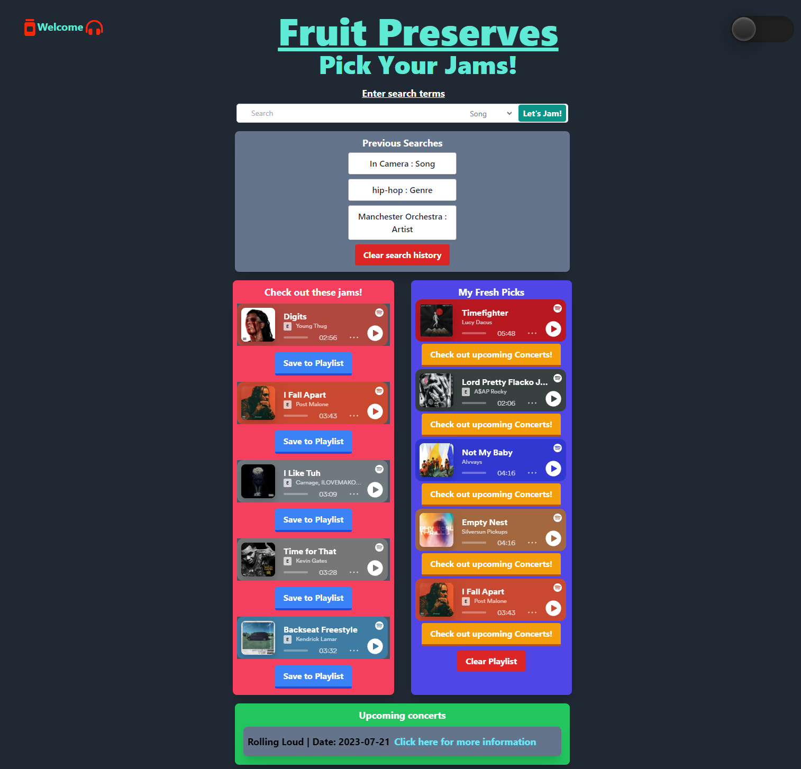

# Fruit Preserves

## Description

The compact nature of this app combined with Spotify’s existing recommendation function provides a quick, easy, and fun way to find new music without being overwhelmed by options. You can search using a keyword representing an artist, song, or genre that you already like. Then you can listen to the songs that are recommended. Find a track you like? Add it to your 'Fresh Picks' playlist! From there you can find out if there’s an upcoming performance from the artist of the songs you saved, that you might otherwise have missed!

Below are instructions on how to get started!

## Instructions

1. Click on the link in the 'Deployed Application' section to start.
2. Once you launch the application, type in a artist, song, or genre that you already like in the search bar.
3. Then select the topic of your search in the dropdown, and press 'Enter' or click 'Let's Jam!'.
4. Once this is completed, you will be presented 5 recommended tracks based on your search terms.
5. You will also notice that once your search is saved for future use! (the 'Clear search history' button will delete all previous searches)
6. Listen to the recommended tracks, and save the one's you like into your 'Fresh Picks' playlist. (the 'Clear playlist' button will delete all saved songs)
7. Click on the 'Check out upcoming Concerts!' button to find out if there’s an upcoming performance from the artist of the songs you saved

## Motivation

Here is a list of our motivations for this project!

- Work with a team building an application
- Better understanding of workflow on GitHub with a team
- Learn more about OAuth and how to navigate Spotify API, and Ticketmaster API
- Practice proper function usage, or learn new ones for specific cases that were new to us
- Continue building habits using console.log to help us troubleshoot bugs
- Creating an application from scratch, and using Tailwind for layout and design
- Create a quick, easy, and fun way to find new music without being overwhelmed by options

## Technologies Used

- HTML
- CSS
- JavaScript
- Tailwind
- Spotify API
- Ticketmaster API

## Deployed Application

[Click here to go to my Weather Outlook application!](https://erikbenedict.github.io/fruit-preserves/)

## Screenshots

## Contributors

- Erik Benedict - erik.r.benedict@gmail.com
   
- Daniel Schopler - dmschopler@gmail.com
   
- Rose Hobbs - akmhobbs@gmail.com
   
- Laura Delaney - jordan3313.lj@gmail.com

## License

[MIT](https://choosealicense.com/licenses/mit/)
